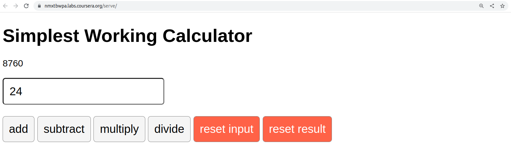

# About the portfolio project

This sample project is the graded assessment for Course 5 - React Basics of the Meta Frontend Developer Certification Program.

The graded assessment requires you to complete a calculator in React. You will be provided with code snippets, and your task is to use these, plus any of your code to complete the calculator that can perform the four basic mathematical operations: addition, subtraction, multiplication, and division.

It will also have a single input button, which will accept user input (any number) and a total starting with a zero.

Once a user types into the input field, they will then have to update the total by pressing any of the four math operation buttons:

- addition
- subtraction
- multiplication
- division

## How to run the app

NOTE: You need to have Node.JS (version 18 or higher) installed in your system.

1. Go to the project root folder where package.json file is present.
2. Open command prompt or vs code terminal.
3. Run "npm install"
4. When the installation of node packages are done, run "npm start".
5. See the url where the app is running. mostly it will be <http://localhost:3000/>
6. Open the above url in browser if it is not opened by the IDE in default browser.
